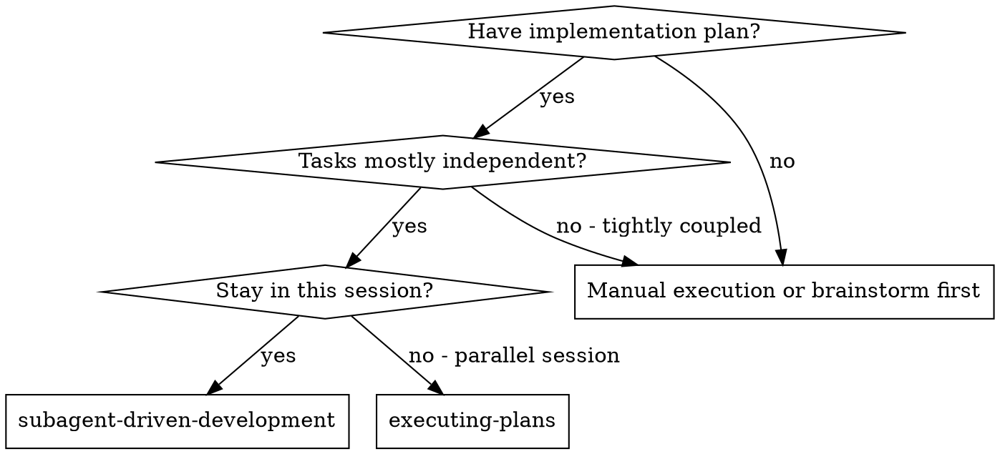
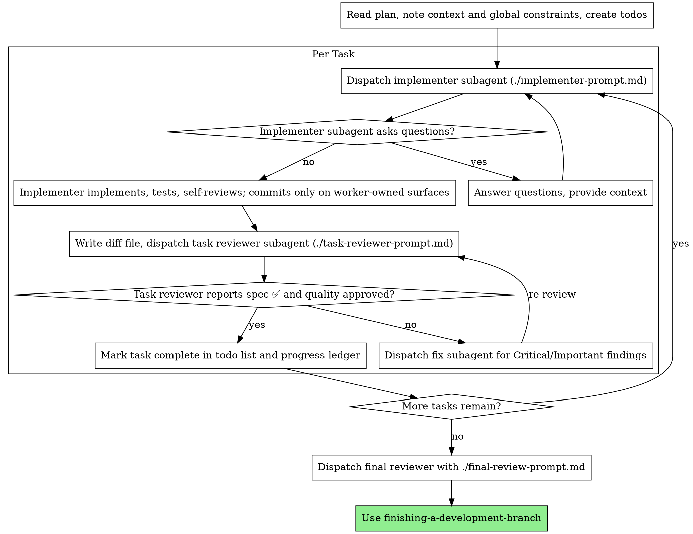

# Subagent-Driven Development

Execute plan by dispatching a fresh implementer subagent per task, a task review (spec compliance + code quality) after each, and a broad whole-branch review at the end.

**Why subagents:** You delegate tasks to specialized agents with isolated context. By precisely crafting their instructions and context, you ensure they stay focused and succeed at their task. They should never inherit your session's context or history — you construct exactly what they need. This also preserves your own context for coordination work.

**Core principle:** Fresh subagent per task + task review (spec + quality) + broad final review = high quality, fast iteration

**Narration:** between tool calls, narrate at most one short line — the
ledger and the tool results carry the record.

**Continuous execution:** Do not pause to check in with your human partner between tasks. Execute all tasks from the plan without stopping. The only reasons to stop are: BLOCKED status you cannot resolve, ambiguity that genuinely prevents progress, or all tasks complete. "Should I continue?" prompts and progress summaries waste their time — they asked you to execute the plan, so execute it.

## When to Use



**vs. Executing Plans (parallel session):**
- Same session (no context switch)
- Fresh subagent per task (no context pollution)
- Review after each task (spec compliance + code quality), broad review at the end
- Faster iteration (no human-in-loop between tasks)

## The Process



## Pre-Flight Plan Review

Before dispatching Task 1, scan the plan once for conflicts:

- tasks that contradict each other or the plan's Global Constraints
- anything the plan explicitly mandates that the review rubric treats as a
  defect (a test that asserts nothing, verbatim duplication of a logic block)

Present everything you find to your human partner as one batched question —
each finding beside the plan text that mandates it, asking which governs —
before execution begins, not one interrupt per discovery mid-plan. If the
scan is clean, proceed without comment. The review loop remains the net for
conflicts that only emerge from implementation.

## Model Selection

Optimize for total cost (tokens x turns x wall-clock), not sticker price per
token. For subagent-driven development, model capability is the default safety
lever and `reasoning_effort` is the normal spend lever. Do not route
consequential implementation or review through a weaker model because it looks
cheaper per token.

### Default And Floors

Default implementer and reviewer model: `gpt-5.6-sol` for consequential code, review, and doctrine work.

Before dispatch, write the closed workload declaration and run
`codex-workload-contract classify`. `setup.sh` installs this command at
`~/.local/bin/codex-workload-contract`, so the same gate works from every repo.
Use the highest foreseeable
risk: labels do not override tool capability, policy density, blast radius,
review finality, irreversibility, or delegation capability. Unknowns fail
upward. Consequential Codex work must use a surface that explicitly selects and
attests `gpt-5.6-sol` plus the contract's effort floor. Generic v2 is advisory
only and cannot author implementation, review, generated-doctrine, shared-state,
or closeout authority.

### Codex Surface Adapter

Classify before every Codex delegation, including advisory exploration. The
generic `Subagent (general-purpose)` template is authoritative only when its
dispatch API selects and later attests the required model, effort, role, fresh
context, and sandbox. Codex generic `spawn_agent` v2 cannot do that; it is
read-only advisory exploration only.

For consequential implementation or review, use an explicit-model Codex MCP
surface and complete `attest` plus `accept`. If no qualified consequential
worker surface is available, stop SDD and continue with a qualified root
outside this skill. A Codex MCP worker returns artifact and test evidence; the
Codex MCP orchestrator owns Git commits after acceptance. Apply the same
qualification to implementers, task reviewers, fixers, and final reviewers.

Preserve the admission gate, bootstrap gate, and acceptance gate. Make the
initial controller `user` prompt's exact first line
`Workload contract ID: <contract_id>` and begin task text on the following
line. Canonical evidence must begin with exactly one `session_meta` row, and a
subagent prefix before its unique bootstrap boundary may contain only
closed-allowlist controller/harness preamble rows. Place the binding before the
first worker-origin or provenance-unknown session row; only harness-owned
controller bootstrap rows, an adjacent inbound-parent metadata/message pair,
and the initial `turn_context` may precede it. Run
`codex-workload-contract attest` only against the OS account's canonical
session JSONL and the artifact, then `accept` with the same evidence. Acceptance
reclassifies the contract and binds `session_evidence_sha256`, a live-verified
canonical repo/base plus Git-parsed complete path manifest, exact artifact
bytes, role, effort, model, session-derived surface, and fresh context. A
requested model, caller-selected session root, strong parent, assistant echo,
or trailing adequate turn is not proof. Nested work must carry an authoritative
delegation-capable `parent_contract_id`; nested authoritative acceptance is
disabled until canonical parent runtime evidence is supplied. Scope expansion
requires a new contract and redispatch. Final review must bind the
controller-known artifact hash and use a distinct non-forked thread with both
authoritative implementation-purpose and review evidence. Same-account JSONL
remains unsigned filesystem evidence; do not describe it as tamper-proof.
Authoritative evidence also requires a non-empty terminal assistant handback
after the final turn with an exact `Artifact: <declared-path>` line (or an exact
comma-delimited `Artifacts:` value) for at least one declared artifact path. Review
handbacks additionally carry the prompt's explicit verdict, and every
authoritative review turn must attest an effective read-only sandbox.

The `gpt-5.6-sol` effort ladder is `low / medium / high / xhigh / max / ultra`.
`ultra` (and `max` on surfaces where `ultra` is unavailable) is the
deep-equivalent lane — use it in place of the prior `gpt-5.5-deep` model when the
blast-radius floor calls for a deep pass.

Preserve the blast-radius floor from the token-spend routing doctrine:

| Work shape | Minimum model posture |
|---|---|
| Critical blast radius: production DDL, schedulers, shared-state writers, security boundary, money/positioning math, rollback/revert | `gpt-5.6-sol` at `reasoning_effort="ultra"` (deep-equivalent lane); `reasoning_effort="max"` only when `ultra` is not exposed by the subagent surface. The base `xhigh` tier is NOT a deep-equivalent substitute for critical blast-radius work — if the surface tops out at `xhigh` or lower, stop for operator direction unless that surface is already ratified as deep-equivalent, and record the runtime-contract exception |
| High blast radius: user-facing logic, process contracts, generated docs, multi-repo/API behavior, final whole-branch review | `gpt-5.6-sol`; use `high` or `xhigh` effort when ambiguity or prior review loops found subtle issues; escalate to `max` when the diff crosses a policy boundary the reviewer must reason about |
| Medium/low blast, mechanical or docs-only | `gpt-5.6-sol` with lower effort unless an evidence-backed exception below applies |

Do not use local, alternate-cloud, or faster lanes for critical blast-radius
work. For high blast-radius routing down, require the same kind of ratified
paired/shadow evidence that the token-spend SPEC requires; a single successful
manual run is smoke, not ratification.

If the only available subagent surface is a Claude-family Agent surface, treat
that as a runtime-contract exception rather than a budget route-down. Use the
highest available Claude-family model that satisfies the same risk floor, avoid
small Claude-family models for consequential SDD work, and stop for operator
direction before critical work when no deep-equivalent surface is available.
On Claude-family surfaces without an effort control, a stronger same-family
model is the effort substitute; record that as a runtime-contract exception in
the ledger.

### Evidence-Backed Exceptions

Alternate cloud or local models are allowed only when the evaluation evidence
matches the workload and configuration you are delegating.

For cloud models, use ph-eval evidence by full cell tuple:
`(driver, model, reasoning_effort, service_tier, thinking_mode, budget_tokens)`.
Do not generalize a result across drivers, effort levels, service tiers, or
budget modes unless the SPEC explicitly says that grouping is valid.

For local LLMs, promotion is scoped to the exact tuple:
`(provider_id, model_file_sha256, llama-server_args)`. No cross-quant,
cross-file, or cross-argument inheritance. A local model that passed one tuple
can be used only for the workload class that cleared the internal heldout and
dream-routine gates, and only after an operator routing decision.

BFCL is triage evidence for candidate prioritization, not routing authority.
Public benchmark movement never overrides internal heldout gates,
zero-fabrication discipline, workload-specific dream-routine validation, or
post-deploy drift telemetry.

### Effort Picker

Choose `reasoning_effort` by risk and ambiguity. The full `gpt-5.6-sol` ladder is
`low / medium / high / xhigh / max / ultra` — six levels, not four. Pick as
tight to the actual shape of the task as you can; the levels above `xhigh` are
reserved for the reviews they were built for and are not blanket upgrades.

| Signal | `reasoning_effort` |
|---|---|
| Exact transcription, single-file docs, mechanical grep/test edits, no policy hooks | `low` |
| Normal implementation task, doc+test edits, simple hook-gated commit, straightforward reviewer pass | `medium` |
| Multi-file change, custom repo hooks/validators, concurrency, security boundary, schema/API contract, ambiguous plan text | `high` |
| Final whole-branch review, high-blast-radius design, correctness-critical architecture, prior review loops found subtle issues | `xhigh` |
| Deep audits on high-blast-radius artifacts (production DDL, dealer positioning / money math, cross-repo schema migrations), ratified-decision relitigation defenses | `max` |
| Hardest reviews — novel SPEC design, cross-family disagreement at R3, critical-blast-radius deep floor (see table above) | `ultra` |

Repo policy density raises effort, not model downgrade. If pre-commit hooks,
delegation-contract validation, claim-check canaries, lint/type gates, CI
workflows, or signed-commit requirements are active, use at least `medium`;
use `high` when the task must reason about those gates rather than merely
pass through them.

### Calibration

After each task, compare actual cost and quality:

- If a `low`/`medium` effort subagent loops, asks for avoidable context, or
  trips a repo gate it should have anticipated, keep `gpt-5.6-sol` and raise
  `reasoning_effort` for the next similar task.
- If a `high`/`xhigh` effort subagent spends heavily on a task that was truly
  mechanical, keep `gpt-5.6-sol` and lower `reasoning_effort` for the next
  similar task.
- If a task still burns tokens at high effort, split the task or improve the
  brief before dispatching another worker.
- Record in the progress ledger:
  `Task N: complete (X turns, Yk tokens, effort: low|medium|high|xhigh|max|ultra, calibration: stay|raise|lower|split)`.

### Reviewer Effort

Reviewers use the same default model: `gpt-5.6-sol`.

- Mechanical diff, exact-file transcription, or `.gitkeep`-style additions:
  `low`.
- Diff touches process contracts, hooks, generated docs, tests, or shared
  behavior: `medium` or `high` depending on ambiguity.
- Final whole-branch review: `high` minimum; use `xhigh` for concurrency,
  security, schema/API, or high-blast-radius branches.

## Handling Implementer Status

### Review Package Helper

Use `/home/rj/git/claude-config/skills/subagent-driven-development/scripts/review-package BASE HEAD [OUTFILE]` to generate reviewer diff packages. The helper prints the unique file path it wrote.

Implementer subagents report one of four statuses. Handle each appropriately:

**DONE:** Generate the review package (`/home/rj/git/claude-config/skills/subagent-driven-development/scripts/review-package BASE HEAD`; BASE is the commit you recorded before dispatching the implementer — never `HEAD~1`, which silently drops all but the last commit of a multi-commit task), then dispatch the task reviewer with the printed path.

**DONE_WITH_CONCERNS:** The implementer completed the work but flagged doubts. Read the concerns before proceeding. If the concerns are about correctness or scope, address them before review. If they're observations (e.g., "this file is getting large"), note them and proceed to review.

**NEEDS_CONTEXT:** The implementer needs information that wasn't provided. Provide the missing context and re-dispatch.

**BLOCKED:** The implementer cannot complete the task. Assess the blocker:
1. If it's a context problem, provide more context and re-dispatch with the same model
2. If the task requires more reasoning, keep `gpt-5.6-sol` and re-dispatch with
   higher `reasoning_effort` (walk up the `low / medium / high / xhigh / max / ultra` ladder — don't jump straight to `ultra` for a task that stalled at `medium`)
3. If the task is too large, break it into smaller pieces
4. If the task is critical blast radius or an evidence-backed exception applies,
   use the Model Selection floors above
5. If the plan itself is wrong, escalate to the human

**Never** ignore an escalation or force the same model to retry without changes. If the implementer said it's stuck, something needs to change.

## Handling Reviewer ⚠️ Items

The task reviewer may report "⚠️ Cannot verify from diff" items — requirements
that live in unchanged code or span tasks. These do not block the rest of the
review, but you must resolve each one yourself before marking the task
complete: you hold the plan and cross-task context the reviewer
lacks. If you confirm an item is a real gap, treat it as a failed spec
review — send it back to the implementer and re-review.

## Constructing Reviewer Prompts

Per-task reviews are task-scoped gates. The broad review happens once, at the
final whole-branch review. When you fill a reviewer template:

- Do not add open-ended directives like "check all uses" or "run race tests
  if useful" without a concrete, task-specific reason
- Do not ask a reviewer to re-run tests the implementer already ran on the
  same code — the implementer's report carries the test evidence
- Do not pre-judge findings for the reviewer — never instruct a reviewer to
  ignore or not flag a specific issue. If you believe a finding would be a
  false positive, let the reviewer raise it and adjudicate it in the review
  loop. If the prompt you are writing contains "do not flag," "don't treat X
  as a defect," "at most Minor," or "the plan chose" — stop: you are
  pre-judging, usually to spare yourself a review loop.
- The global-constraints block you hand the reviewer is its attention
  lens. Copy the binding requirements verbatim from the plan's Global
  Constraints section or the spec: exact values, exact formats, and the
  stated relationships between components ("same layout as X", "matches
  Y"). The reviewer's template already carries the process rules (YAGNI,
  test hygiene, review method) — the constraints block is for what THIS
  project's spec demands.
- Hand the reviewer its diff as a file: run this skill's
  `/home/rj/git/claude-config/skills/subagent-driven-development/scripts/review-package BASE HEAD` and pass the reviewer the file path
  it prints (or, without bash: `git log --oneline`, `git diff --stat`,
  and `git diff -U10` for the range, redirected to one uniquely named
  file). The output never enters your own context, and the reviewer sees
  the commit list, stat summary, and full diff with context in one Read
  call. Use the BASE you recorded before dispatching the implementer —
  never `HEAD~1`, which silently truncates multi-commit tasks.
- A dispatch prompt describes one task, not the session's history. Do not
  paste accumulated prior-task summaries ("state after Tasks 1-3") into
  later dispatches — a real session's dispatch hit 42k chars of which 99%
  was pasted history. A fresh subagent needs its task, the interfaces it
  touches, and the global constraints. Nothing else.
- Dispatch fix subagents for Critical and Important findings. Record Minor
  findings in the progress ledger as you go, and point the final
  whole-branch review at that list so it can triage which must be fixed
  before merge. A roll-up nobody reads is a silent discard.
- A finding labeled plan-mandated — or any finding that conflicts with
  what the plan's text requires — is the human's decision, like any plan
  contradiction: present the finding and the plan text, ask which governs.
  Do not dismiss the finding because the plan mandates it, and do not
  dispatch a fix that contradicts the plan without asking.
- The final whole-branch review gets a package too: run
  `/home/rj/git/claude-config/skills/subagent-driven-development/scripts/review-package MERGE_BASE HEAD` (MERGE_BASE = the commit the
  branch started from, e.g. `git merge-base main HEAD`) and include the
  printed path in the final review dispatch, so the final reviewer reads
  one file instead of re-deriving the branch diff with git commands.
- Before final review, create an authoritative whole-branch integration
  implementation contract for the exact merge-base diff, with
  `implementation_lineage: whole_branch_integration` on both that contract and
  the final-review contract. When multiple task
  implementers contributed, the qualified root must independently reproduce
  and verify their substantive work under that contract, then attest the exact
  whole-branch artifact; preserve the narrower per-task attestations in the
  progress ledger. A task-scoped attestation alone cannot establish
  whole-branch lineage.
- Dispatch final review through `./final-review-prompt.md`. Bind the review
  contract, whole-branch integration implementation contract and accepted
  integration attestation, integration session log, distinct non-forked review
  session log, and controller-known artifact SHA-256. Both contracts must name
  the same repository, base SHA, artifact kind, implementation lineage, and
  complete path manifest.
  The controller must run `attest` and `accept` before consuming the verdict.
- Every fix dispatch carries the implementer contract: the fix subagent
  re-runs the tests covering its change and reports the results. Name the
  covering test files in the dispatch — a one-line fix does not need the
  whole suite. Before re-dispatching the reviewer, confirm the fix report
  contains the covering tests, the command run, and the output; dispatch
  the re-review once all three are present.
- If the final whole-branch review returns findings, dispatch ONE fix
  subagent with the complete findings list — not one fixer per finding.
  Per-finding fixers each rebuild context and re-run suites; a real
  session's final-review fix wave cost more than all its tasks combined.

## File Handoffs

Everything you paste into a dispatch prompt — and everything a subagent
prints back — stays resident in your context for the rest of the session
and is re-read on every later turn. Hand artifacts over as files:

- **Task brief:** before dispatching an implementer, run this skill's
  `scripts/task-brief PLAN_FILE N` — it extracts the task's full text to a
  uniquely named file and prints the path. Compose the dispatch so the
  brief stays the single source of requirements. Your dispatch should
  contain: (1) one line on where this task fits in the project; (2) the
  brief path, introduced as "read this first — it is your requirements,
  with the exact values to use verbatim"; (3) interfaces and decisions
  from earlier tasks that the brief cannot know; (4) your resolution of
  any ambiguity you noticed in the brief; (5) the report-file path and
  report contract. Exact values (numbers, magic strings, signatures, test
  cases) appear only in the brief.
- **Report file:** name the implementer's report file after the brief
  (brief `…/task-N-brief.md` → report `…/task-N-report.md`) and put it in
  the dispatch prompt. The implementer writes the full report there and
  returns only status, commits, a one-line test summary, and concerns.
- **Reviewer inputs:** the task reviewer gets three paths — the same brief
  file, the report file, and the review package — plus the global
  constraints that bind the task.
- Fix dispatches append their fix report (with test results) to the same
  report file and return a short summary; re-reviews read the updated file.

## Durable Progress

Conversation memory does not survive compaction. In real sessions,
controllers that lost their place have re-dispatched entire completed task
sequences — the single most expensive failure observed. Track progress in
a ledger file, not only in todos.

- At skill start, check for a ledger:
  `cat "$(git rev-parse --show-toplevel)/.superpowers/sdd/progress.md"`. Tasks listed there
  as complete are DONE — do not re-dispatch them; resume at the first task
  not marked complete.
- When a task's review comes back clean, append one line to the ledger in
  the same message as your other bookkeeping:
  `Task N: complete (commits <base7>..<head7>, review clean)`.
- The ledger is your recovery map: the commits it names exist in git even
  when your context no longer remembers creating them. After compaction,
  trust the ledger and `git log` over your own recollection.
- `git clean -fdx` will destroy the ledger (it's git-ignored scratch); if
  that happens, recover from `git log`.

## Prompt Templates

- [implementer-prompt.md](implementer-prompt.md) - Dispatch implementer subagent
- [task-reviewer-prompt.md](task-reviewer-prompt.md) - Dispatch task reviewer subagent (spec compliance + code quality)
- [final-review-prompt.md](final-review-prompt.md) - Dispatch a qualified final whole-branch reviewer using requesting-code-review's rubric

## Example Workflow

```
You: I'm using Subagent-Driven Development to execute this plan.

[Read plan file once: docs/superpowers/plans/feature-plan.md]
[Create todos for all tasks]

Task 1: Hook installation script

[Run task-brief for Task 1; dispatch implementer with brief + report paths + context]

Implementer: "Before I begin - should the hook be installed at user or system level?"

You: "User level (~/.config/superpowers/hooks/)"

Implementer: "Got it. Implementing now..."
[Later] Implementer:
  - Implemented install-hook command
  - Added tests, 5/5 passing
  - Self-review: Found I missed --force flag, added it
  - Committed

[Run /home/rj/git/claude-config/skills/subagent-driven-development/scripts/review-package, dispatch task reviewer with the printed path]
Task reviewer: Spec ✅ - all requirements met, nothing extra.
  Strengths: Good test coverage, clean. Issues: None. Task quality: Approved.

[Mark Task 1 complete]

Task 2: Recovery modes

[Run task-brief for Task 2; dispatch implementer with brief + report paths + context]

Implementer: [No questions, proceeds]
Implementer:
  - Added verify/repair modes
  - 8/8 tests passing
  - Self-review: All good
  - Committed

[Run /home/rj/git/claude-config/skills/subagent-driven-development/scripts/review-package, dispatch task reviewer with the printed path]
Task reviewer: Spec ❌:
  - Missing: Progress reporting (spec says "report every 100 items")
  - Extra: Added --json flag (not requested)
  Issues (Important): Magic number (100)

[Dispatch fix subagent with all findings]
Fixer: Removed --json flag, added progress reporting, extracted PROGRESS_INTERVAL constant

[Task reviewer reviews again]
Task reviewer: Spec ✅. Task quality: Approved.

[Mark Task 2 complete]

...

[After all tasks]
[Dispatch final code-reviewer]
Final reviewer: All requirements met, ready to merge

Done!
```

## Advantages

**vs. Manual execution:**
- Subagents follow TDD naturally
- Fresh context per task (no confusion)
- Parallel-safe (subagents don't interfere)
- Subagent can ask questions (before AND during work)

**vs. Executing Plans:**
- Same session (no handoff)
- Continuous progress (no waiting)
- Review checkpoints automatic

**Efficiency gains:**
- Controller curates exactly what context is needed; bulk artifacts move
  as files, not pasted text
- Subagent gets complete information upfront
- Questions surfaced before work begins (not after)

**Quality gates:**
- Self-review catches issues before handoff
- Task review carries two verdicts: spec compliance and code quality
- Review loops ensure fixes actually work
- Spec compliance prevents over/under-building
- Code quality ensures implementation is well-built

**Cost:**
- More subagent invocations (implementer + reviewer per task)
- Controller does more prep work (extracting all tasks upfront)
- Review loops add iterations
- But catches issues early (cheaper than debugging later)

## Red Flags

**Never:**
- Start implementation on main/master branch without explicit user consent
- Skip task review, or accept a report missing either verdict (spec compliance AND task quality are both required)
- Proceed with unfixed issues
- Dispatch multiple implementation subagents in parallel (conflicts)
- Make a subagent read the whole plan file (hand it its task brief —
  `scripts/task-brief` — instead)
- Skip scene-setting context (subagent needs to understand where task fits)
- Ignore subagent questions (answer before letting them proceed)
- Accept "close enough" on spec compliance (reviewer found spec issues = not done)
- Skip review loops (reviewer found issues = implementer fixes = review again)
- Let implementer self-review replace actual review (both are needed)
- Tell a reviewer what not to flag, or pre-rate a finding's severity in the
  dispatch prompt ("treat it as Minor at most") — the plan's example code is
  a starting point, not evidence that its weaknesses were chosen
- Dispatch a task reviewer without a diff file — generate it first
  (`/home/rj/git/claude-config/skills/subagent-driven-development/scripts/review-package BASE HEAD`) and name the printed path in the
  prompt
- Move to next task while the review has open Critical/Important issues
- Re-dispatch a task the progress ledger already marks complete — check
  the ledger (and `git log`) after any compaction or resume

**If subagent asks questions:**
- Answer clearly and completely
- Provide additional context if needed
- Don't rush them into implementation

**If reviewer finds issues:**
- Implementer (same subagent) fixes them
- Reviewer reviews again
- Repeat until approved
- Don't skip the re-review

**If subagent fails task:**
- Dispatch fix subagent with specific instructions
- Don't try to fix manually (context pollution)

## Integration

**Required workflow skills:**
- **using-git-worktrees** - Ensures isolated workspace (creates one or verifies existing)
- **writing-plans** - Creates the plan this skill executes
- **requesting-code-review** - Code review template for the final whole-branch review
- **finishing-a-development-branch** - Complete development after all tasks

**Subagents should use:**
- **test-driven-development** - Subagents follow TDD for each task

**Alternative workflow:**
- **executing-plans** - Use for parallel session instead of same-session execution
